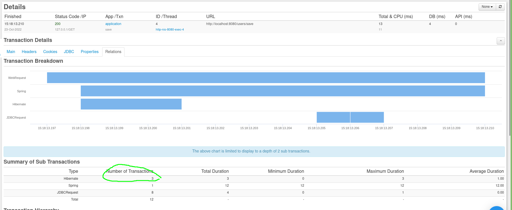

## SQL Frameworks

Nowadays, the majority of the Java backends are using some sort of the permanent
storage SQL being the most dominant in the market. The default API to
communicate with the SQL databases is a specification called JDBC (a bunch of
Java interfaces that database developers must implement
in order to let the end users talk to the Database over the wire).
The problem is that using plain JDBC is hard for a regular developer because of

1. All queries must be written manually
2. The parsing of the data transferred over the wire must be done manually(using
   ResultSets)
3. Most of the methods from JDBC API throw checked exceptions which forces
   developers to deal with blobs of try catch statements
4. All transactions must be opened and closed manually

There are many frameworks that help you to deal with the problems mentioned
above. According
to [2022 survey by Josh Long](https://vladmihalcea.com/java-data-access-technology/)
the most popular frameworks are

1. JPA(Hibernate or EclipseLink)
2. raw JDBC wrappers (such as Spring based JdbcTemplate class)
3. JOOQ
4. MyBatis
   All of them solve the problems above in different and unique ways.

Today however we want to show how FusionReactor can help regular developers to
work with the listed frameworks

# Hibernate

Hibernate is one of the oldest and most mature ORM framework in the Java world.
Being a JPA implementation it solves JDBC problems by replacing direct,
persistent database accesses with high-level object handling functions. The most
important feature is the mapping Java classes into corresponding SQL tables.
Hibernate uses data manipulation over the Java classes and generates proper SQL
statements.
In order to test Hibernate with FusionReactor we will use a simple SpringBoot
project with spring-data as an even higher level of abstraction over Hibernate.
Here is the schema

```sql
CREATE TABLE users
(
    ID   BIGINT PRIMARY KEY AUTO_INCREMENT,
    name varchar(255)
);

create table orders
(
    ID      BIGINT PRIMARY KEY AUTO_INCREMENT,
    price   double precision,
    user_id BIGINT references users (ID)
);
```

One user has many orders.
First of all we need to generate mapping classes for both tables(Lombok will be
used to auto-generate POJO methods)

```java

@Entity
@Data
@Table(name = "users")
class User {

    @Id
    @GeneratedValue(strategy = GenerationType.AUTO)
    private Long id;

    @Column(name = "name")
    private String name;

    @OneToMany(cascade = CascadeType.ALL)
    @JoinColumn(name = "user_id")
    private Set<Order> items = new HashSet<>();
}

@Table(name = "orders")
@Entity
@Data
@NoArgsConstructor
@AllArgsConstructor
class Order {

    @Id
    @GeneratedValue(strategy = GenerationType.AUTO)
    private Long id;

    private double price;

    private String name;

    @ManyToOne(fetch = FetchType.LAZY)
    @JoinColumn(name = "user_id")
    private User user;

    Order(double price, String name) {
        this.price = price;
        this.name = name;
    }
}
```

Next we need to create a repository interface

```java
public interface UserRepository extends JpaRepository<User, Long> {
}
```

Finally, we need to set up the configuration in property/yml file

```properties
spring.datasource.url=jdbc:h2:mem:testdb
spring.data.jpa.repositories.bootstrap-mode=default
```

The last two lines allow you to see a formatted SQL generated by Hibernate in
the console.
Lastly, to test it we will use a simple Rest Controller that

1. Fires `Thread.sleep` every 5th call to simulate long-running queries
2. Throws an exception every 3rd call to simulate a business level error

```java

@RestController
@RequestMapping("/users")
public class UserController {

    private final UserRepository userRepository;

    @GetMapping("/save")
    public Long save() {
        final int condition = this.cnt.getAndIncrement();
        if (condition % 2 == 0) {
            TimeUnit.SECONDS.sleep(3);
        }
        final User user = new User();
        user.setName(UUID.randomUUID().toString());
        user.setItems(
            Set.of(
                new Order(12.0, "Banana"),
                new Order(12.0, "Apple")
            )
        );
        this.userRepository.save(user);
        if (condition % 5 == 0) {
            throw new RuntimeException("Business error");
        }
        return user.getId();
    }
}
```

Let's send some traffic to the backend and see what insides FusionReactor will
give us

```shell
#!/bin/bash
for i in {1..100}
do
  curl http://localhost:8080/users/save
done

```

(The source code is
available [here](https://github.com/strogiyotec/fusion-reactor-jvisualvm-blog/tree/hibernate))

## Transaction details

First of all we can the list of all DB transactions (Transactions -> History)


As you can see some of them have failed , some took 3000ms(3 sec) and
succeeded and others only took a few milliseconds.
Let's see if FusionReactor can help us to understand why some of these
transactions have failed.
If you click on the details button(the book icon next to the transaction ) you
will see the page with all the transaction details

First 3 links are HTTP Request specific so we will skip them for now and will
keep our focus on SQL part

### JDBC

JDBC page gives you the JDBC summary

1. The time it took to execute all the queries
2. All the queries executed by the transaction

As you can see ,a single transaction has executed 8 queries. Doesn't seem what
you want to have from saving a single user with 2 orders

### Relations

Relations page is particularly useful because it shows you
all the queries in a hierarchical order

Let's break down this list

1. Hibernate has generated 3 primary keys from the given sequences
2. 1 query to insert the user
3. 2 queries to insert two orders(notice that user_id is null for both orders)
4. 2 update queries to set user id to newly created orders

(If you want to know how to optimize mapping to decrease the amount of queries
we
highly recommend this
wonderful [blog](https://vladmihalcea.com/the-best-way-to-map-a-onetomany-association-with-jpa-and-hibernate/)
post from Vlad Mihalcea)

### Event snapshot

Another important page that can help you to understand the root cause of the
error is Event Snapshot


This page shows you:

1. The decompiled source code will show you the line where this error has been
   thrown
2. The stacktrace on the left bottom corner can help you to understand the
   request cycle
3. Variables page on the bottom right shows you all the variables which were
   present before the error (the `condition` int was 25)

## JDBC

All the insides described above were only a part of the Transactions page.
FusionReactor can show you much more
in the JDBC page.

The first important part that you should go through is a Settings tab

### Settings

Setting allows you to customize the FusionReactor behaviour in different ways
starting from
settings your own threshold for long transactions and ending with query plan
generation for long transactions(helps teams to decide whether the particular
query will benefit by introducing an index)
By default, Spring Boot can generate and print SQL queries generated by
Hibernate and while this feature is useful, it has one limitation namely
All prepared statement parameters are hidden with placeholders `?`. On the other
hand, as you have seen previously, FusionReactor shows
the queries with all corresponding SQL arguments. While this feature can be
really
helpful in the local development where
you can directly copy the sql statement and paste it into your RDMS of choice to
make some tests, the
feature can be dangerous in the production environment leaking user credentials
when customers are trying to log in into your application. We highly recommend
to
disable this feature in production(Can be done within the Setting page)

### Longest transactions

One of the main differences between the Longest Transactions in Request and JDBC
pages is that JDBC one only shows you how long each SQL query took.

As you can see there are no transactions that took 3 seconds
because `Thread.sleep` that we call in the Controller level is not a part of the
query. Another thing is that all transactions in this list have succeeded ,
despite the fact that Java throws an error it doesn't affect whether the
query itself will fail.
As an example let's change the schema a little and make the order
name(`name varchar(255) unique`) to be unique.
In this case if you try to run the same load test again you will see that some
transactions have failed

As always , clicking on details page will show you Event Snapshots with detailed
information

### Graphs

To better visualize the jdbc statistics, FusionReactor provides two graphics

1. Time graph
2. Activity graph

The time graph shows historical average durations of the following jdbc requests

1. Completed
2. Active
3. Failed


The time interval is configurable and all the transactions are persisted

On the other hand, the activity graph shows you the counts for listed requests.
It can help you to visualize the peak traffic on your websites.

### Error history

The error history page only shows the JDBC level errors(while Request history
shows you the HTTP request level errors )

As can be seen from the image above, the only JDBC error so far is unique
violation constraint on insert

### Database

Last but not list is a Database page which shows you a nice break-down of all
JDBC activities using pie charts

The pie charts show you

1. Total time by queries
2. Total time by tables
3. Query counts by operation
4. Query counts by table

## Metrics

One of the main metric types supported by JVM is JMX. Configured JMX beans can
be monitored and reconfigured on runtime. One of the most important part to
monitor in backend apps is a database connection pooling.
By default, Spring preconfigures Hikari connection pool and by adding this line
into your config file `spring.datasource.hikari.register-mbeans=true` it will
generate corresponding MBeans that you can see in Metrics page

All the settings are configurable and can be monitored using the start icon. The
metrics then can be exported to CloudWatch if you are using AWS infrastructure

## Hibernate pitfalls

Hibernate as a framework has a deep learning curve. There is a lot of
reflection manipulation going on under the hood.
In Spring boot, by default , the database transaction is opened on the
controller level. Why
does it happen ? If you load an entity that has a lazy collection and then want
to
use the collection, the session in controller level will fire a separate SQL
query to fetch the data for this collection from Database. The problem here
is that database transactions must be opened once they are required(preferably
in the Service layer), otherwise the long-running transactions will force the
connection pool to create new DB connections to serve new users. To disable
this behaviour you need to
pass this line into your config file `spring.jpa.open-in-view=false`.
Let's run the load test again. If you check the JDBC history,however, you won't
see
any anomalies. But if you open the Transaction Details
in `Transactions->History` page and then go to **Relations** to see transaction
Breakdown you will notice that Hibernate has opened 3 separate transactions
instead of 1

To fix this problem simply add `@Transactional` annotation on top of the `save`
method

## MyBatis

As we have seen, Hibernate simplifies the persistent layer. However, the
developer must understand what's going on under the hood in order to optimize
the default framework's behaviour.
On the other hand, there is another popular Java framework, that doesn't do a
lot of "black magic" under the hood, namely MyBatis.
According to documentation
> MyBatis is a first class persistence framework with support for custom SQL,
> stored procedures and advanced mappings

The developers who use MyBatis have full control over the SQL queries using a
user-friendly xml or annotation based API(with an introduction of multiline
Strings
in java 14 the Annotation API should be preferred).
Let's rewrite the previous example using MyBatis. First we need to get rid of
all JPA specific annotations from Entity classes.
Next we have to write sql on our own using xml files. For this example we will
rewrite the Repository class that saves user with corresponding orders(Code
examples are
available [here](https://github.com/strogiyotec/fusion-reactor-jvisualvm-blog/tree/mybatis))
Here is the Mapper class

```java

@Mapper
public interface UserMapper {

    void saveUser(User user);

    void saveOrders(@Param("orders") List<Order> orders, @Param("userId") long userId);

    default void saveUserWithOrders(User user) {
        this.saveUser(user);
        this.saveOrders(user.getOrders(), user.getId());
    }
}
```

and here is the corresponding xml file

```xml

<mapper namespace="com.fusion.reactor.UserMapper">

    <resultMap id="UserResultMap" type="com.fusion.reactor.User">
        <id column="id" property="id"/>
        <result column="name" property="name"/>
    </resultMap>

    <insert id="saveUser" parameterType="com.fusion.reactor.User" useGeneratedKeys="true" keyProperty="id" keyColumn="id">
        INSERT INTO users (name)
        VALUES (#{name})
    </insert>

    <insert id="saveOrders" parameterType="map">
        INSERT INTO orders (
        price,user_id,name
        )
        VALUES
        <foreach collection="orders" item="order" index="index" open="(" separator="),(" close=")">
            #{order.price},
            #{userId},
            #{order.name}
        </foreach>
    </insert>
</mapper>
```

As you can see we explicitly wrote two queries, first to save the user and
second to save a list of orders. No autogenerated queries and no automapping as
in Hibernate. Everything has to be done manually. Let's run load tests again and
see JDBC transaction history.

FusionReactor will show you that MyBatis indeed generated queries that you
specified with all the parameters displayed, so you can verify that mappers are
working as expected
Going to Relations page in transaction detail for one of the requests we can see
that single request used 1 transaction and 2 jdbc queries


The MyBatis plugin for intellij has a language server support to write type safe
xml files, however if you want a
compile time support there is another framework to consider

## JOOQ

The last SQL framework that we will cover today is JOOQ. According to the
official website
> jOOQ generates Java code from your database and lets you build type safe SQL
> queries through its fluent API.

JOOQ is different from two previous frameworks in that it generates java classes
from SQL tables on compile time. All compiled java classes are part of the
classpath and can be accessed during development. As latest spring-boot-jooq
starter does [not support H2](https://github.com/jOOQ/jOOQ/issues/13785) we will
use Postgres as a RDMS(source code is
available [here](https://github.com/strogiyotec/fusion-reactor-jvisualvm-blog/tree/jooq))
.
First we need to run `mvn clean install` to generate java classes. Next we will
write same query that saves user and two orders but using JOOQ API.

```java

@RestController
@RequestMapping("/users")
public class UserController {

    @Autowired
    private DSLContext dslContext;

    @GetMapping("/save")
    public long save() {
        final Record1<Integer> id = this.dslContext.insertInto(Tables.USERS)
            .columns(Tables.USERS.NAME)
            .values(UUID.randomUUID().toString())
            .returningResult(Tables.USERS.ID)
            .fetchOne();
        final Integer userId = id.getValue(Tables.USERS.ID);
        this.dslContext.insertInto(Tables.ORDERS)
            .columns(Tables.ORDERS.USER_ID, Tables.ORDERS.NAME, Tables.ORDERS.PRICE)
            .values(userId, "Banana", 12.5)
            .values(userId, "Apples", 13.0)
            .execute();
        return userId;
    }
}
```

FusionReactor works with JOOQ the same way as it works with all other
frameworks. All generated classes will be stored in the jar file, so you don't
have to do anything else to integrate JOOQ with FusionReactor.
After running load testing we can see in JDBC history tab that JOOQ indeed just
uses two sql queries


JOOQ is easier to use than MyBatis because of the compile time checking from the
compiler ,syntax highlighting from your editor and auto mapping from SQL tables
to java classes. It is however not as powerful
as Hibernate in that you still need to write all queries on your own.

## Conclusion

All 3 frameworks have their niche among java developers. Still, nowadays most
companies prefer Hibernate in order to speed up the development time, while
other companies prefer lighter frameworks such as JOOQ and MyBatis in order to
have full control over the SQL and as a result write more optimized code
without relying on sql generated by JPA. FusionReactor supports all of these
frameworks and can give you insides of underlying SQL queries executed by your
code and performance metrics for each individual query.
As you have seen, with FusionReactor it's really easy to see whether Hibernate
behaves the way you expect. 
If you are interested,
please [book a demo](https://calendly.com/fusionreactor-sales/fusionreactor-demo)
with us or
just [download a trial](https://www.fusion-reactor.com/select-free-trial-plan/).


